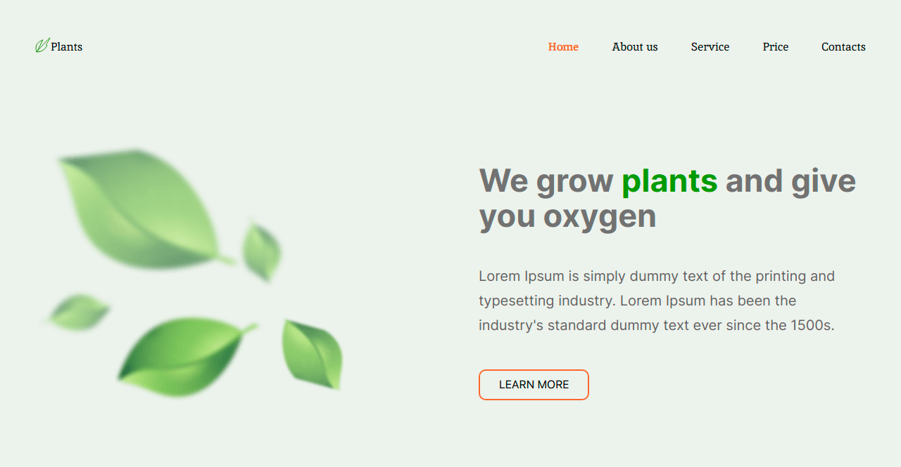

# Plants landing page

## Built with

  

## About project

Educational project of the preparatory course [«JavaScript/Front-end. Stage 0»](https://rs.school/js-stage0)

Plants is a task during which I will make up the landing page of a site that offers its services for growing plants in the garden and caring for them, making it adaptive and interactive.

## Key skills:

* pixel perfect layout
* valid semantic adaptive layout
* easy to maintain readable code
* export styles and graphics from Figma
* using JavaScript to implement functionality

### Demo [Plants](https://plants-tau.vercel.app)
